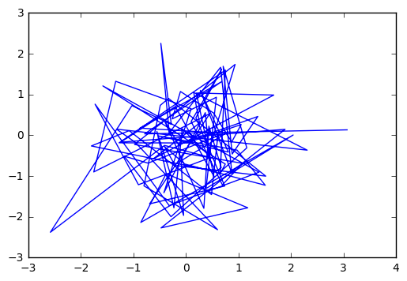
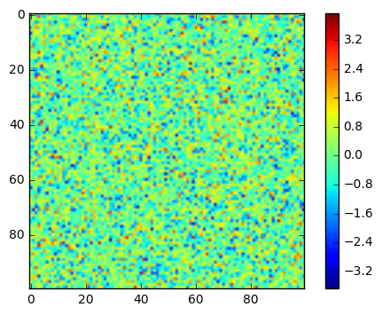

## 1.3.1.1. What are NumPy and NumPy arrays?
### 1.3.1.1.1. NumPy arrays


```python
import numpy as np

```


```python
a = np.array([1,2,3,4])
a

```


    array([1, 2, 3, 4])


```python
L = range(1000)
%timeit [i**2 for i in L]
```

    10000 loops, best of 3: 100 µs per loop


```python
l = np.arange(1000)
%timeit l**2
```

    The slowest run took 13.35 times longer than the fastest. This could mean that an intermediate result is being cached.
    100000 loops, best of 3: 1.95 µs per loop


### Q

As given from the website:
> Why it is useful: Memory-efficient container that provides fast numerical operations.

<font color='brown'>**I cannot find the numpy run faster.**</font>

Because, with 100000 loops and best of 3: 1.72 µs per loop, the implemention would consume at most 172*1000 us. Besides, the normal loops only spent 93.9*1000us.
<!--More-->

# 1.3.1.2. Creating arrays
## 1.3.1.2.1. Manual construction of arrays


```python
a = np.array([0, 1, 2, 3])
a
```
array([0, 1, 2, 3])

```python
b = np.array([[0, 1, 2], [3, 4, 5]])
b
```
    array([[0, 1, 2],
           [3, 4, 5]])
```python
b.ndim
```


    2


```python
b.shape
```


    (2, 3)


```python
len(b)
```


    2


```python
c = np.array([[[1], [2]], [[3], [4]]])
c
```


    array([[[1],
            [2]],

           [[3],
            [4]]])


```python
c.shape
```


    (2, 2, 1)


### Exercise: Simple arrays

Create a simple two dimensional array. First, redo the examples from above. And then create your own: how about odd numbers counting backwards on the first row, and even numbers on the second?
Use the functions len(), numpy.shape() on these arrays. How do they relate to each other? And to the ndim attribute of the arrays?

### Task:
- create 2 dim array
- Redo the examples from above
- create your own
    - odd numbers counting backwards on first row
    - even numbers on the second
- function len(), numpy.shape apply
- How do they relate to each other, And to the ndim


```python
a = np.array([
[9,7,5,3,1],
[8,6,4,2,0]])
a
len(a)
a.shape
a.ndim
```


    2


### 1.3.1.2.2. Functions for creating arrays


```python
a = np.random.rand(4)       # uniform in [0, 1]
a  


b = np.random.randn(4)      # Gaussian
b  


c = np.random.seed()        # Setting the random seed

```

### Exercise: Creating arrays using functions
Experiment with arange, linspace, ones, zeros, eye and diag.
Create different kinds of arrays with random numbers.
Try setting the seed before creating an array with random values.
Look at the function np.empty. What does it do? When might this be useful?

### Task:
- Test arange, linspace, ones, zeros, eye and diag
- create different kinds of arrays with random numbers.
- Try setting the seed before creating an array with random values.
- Look at np.empty. What do it do ? When might this be useful


```python
np.arange(20,0,-2)
np.linspace(1,19,num=9,endpoint=True, retstep=True)
np.ones((3,4))
np.zeros((3,4))
np.eye(4)
np.diag([1,2,3,4])

# np.diag(np.reshape(np.arange(0,16), (4,4)))
# np.arange?
```


    array([[1, 0, 0, 0],
           [0, 2, 0, 0],
           [0, 0, 3, 0],
           [0, 0, 0, 4]])


### Key Point

* Signature: np.diag(v, k=0)
* Docstring:
<font color="brown">Extract a diagonal</font>or construct a diagonal array.
* Parameters
* v : array_like
    If `v` is a 2-D array, return a copy of its `k`-th diagonal.
    If `v` is a 1-D array, return a 2-D array with `v` on the `k`-th
    diagonal.


```python
np.random.seed(1200)
np.random.randn(10)
```


    array([ 0.52202163,  0.06994681,  0.86923015,  0.42455383, -0.22096011,
           -0.63208633, -0.45569908, -0.68187405,  0.38716295, -0.00974795])


```python
np.random.seed(2200)
np.random.randn(10)
```


    array([-0.78537866,  0.95078196, -0.02769646, -1.23586006, -0.5781107 ,
            0.71370111, -0.68691587,  1.08717324,  0.02441534, -1.22960993])


```python
np.empty((4,5))
```


    array([[ -3.10503618e+231,  -3.10503618e+231,   1.58101007e-322,
              0.00000000e+000,   0.00000000e+000],
           [  0.00000000e+000,   0.00000000e+000,   0.00000000e+000,
              0.00000000e+000,   0.00000000e+000],
           [  0.00000000e+000,   0.00000000e+000,  -3.10503618e+231,
             -3.10503618e+231,  -3.10503618e+231],
           [ -3.10503618e+231,  -3.10503618e+231,  -3.10503618e+231,
             -3.10503618e+231,  -3.10503618e+231]])


```python
np.empty((4,7))
```


    array([[ -3.10503618e+231,  -3.10503618e+231,   1.97626258e-322,
              0.00000000e+000,   0.00000000e+000,   0.00000000e+000,
              0.00000000e+000],
           [  0.00000000e+000,   0.00000000e+000,   0.00000000e+000,
              0.00000000e+000,   0.00000000e+000,  -3.10503618e+231,
             -3.10503618e+231],
           [  1.67982320e-322,   2.20419081e-314,  -3.10503618e+231,
             -3.10503618e+231,   2.12199581e-314,   2.12199579e-314,
              0.00000000e+000],
           [  0.00000000e+000,   6.93481139e-310,   0.00000000e+000,
              0.00000000e+000,   0.00000000e+000,   6.93481139e-310,
              6.93481139e-310]])


#### Key Points:
<font color='brown'>Docstring:</font>
empty(shape, dtype=float, order='C')

Return a new array of given shape and type, without initializing entries.


## 1.3.1.3. Basic data types
You may have noticed that, in some instances, array elements are displayed with a trailing dot (e.g. 2. vs 2). This is due to a difference in the data-type used:


```python
a = np.array([1, 2, 3])
a.dtype
```


    dtype('int64')


```python

b = np.array([1., 2., 3.])
b.dtype
```


    dtype('float64')


You can explicitly specify which data-type you want:


```python
c = np.array([1, 2, 3], dtype=float)
c.dtype

```


    dtype('float64')


The default data type is floating point:


```python
a = np.ones((3, 3))
a.dtype

```


    dtype('float64')


```python
d = np.array([1+2j, 3+4j, 5+6*1j])
d.dtype
```


    dtype('complex128')


## 1.3.1.4. Basic visualization
From the notebook, enable plots in the notebook. The inline is important for the notebook, so that plots are displayed in the notebook and not in a new window.


```python
%matplotlib inline
```


```python
import matplotlib.pyplot as plt
```

you have to use show explicitly if you have not enabled interactive plots with %matplotlib

### Exercise: Simple visualizations
Plot some simple arrays: a cosine as a function of time and a 2D matrix.
Try using the gray colormap on the 2D matrix.

### Task
- Plot simple arrays, a cosine as a function of time
- 2D m
- gray colormap on the 2D matrix

#### Task One


```python
# np.lookfor("function cos")
# help(np.cos)
# np.info(np.cos)
# np.cos(np.array([0, np.pi/2, np.pi]))

t = np.linspace(0,4*np.pi,1000)
y = np.cos(t)
plt.plot(t,y)
```


    [<matplotlib.lines.Line2D at 0x10aaa9a50>]


#### Task Two
Plot 2D matrix


```python
a = np.random.randn(100,100)
plt.plot(a[0],a[1])
# help(np.random.rand)
```


    [<matplotlib.lines.Line2D at 0x10ab27c10>]





#### Task Three

gray colormap on the 2D matrix


```python
a = np.random.randn(100,100)
plt.imshow(a)
# help(np.random.rand)
plt.colorbar()
```
<matplotlib.colorbar.Colorbar at 0x10b9c5910>

<!--  -->


## 1.3.1.5. Indexing and slicing

> The items of an array can be accessed and assigned to the same way as other Python sequences (e.g. lists):


### Exercise: Indexing and slicing
Try the different flavours of slicing, using start, end and step: starting from a linspace, try to obtain odd numbers counting backwards, and even numbers counting forwards.
Reproduce the slices in the diagram above. You may use the following expression to create the array:
```python
np.arange(6) + np.arange(0, 51, 10)[:, np.newaxis]
```

### Task

- different slicing , using start , end and step
- starting form a linespace, try to obtain odd number counting backwards
- even numbers counting forwards
- reproduce the slices in the diagram above

#### Task One: different slicing , using start , end and step


```python
a = np.arange(0,20,2)
a
```


    array([ 0,  2,  4,  6,  8, 10, 12, 14, 16, 18])


```python
a[1:]
a[:-1]
a[1:-1:2]
```


    array([ 2,  6, 10, 14])


#### Task Two:
- starting form a linespace, try to obtain odd number counting backwards
- even numbers counting forwards


```python
a = np.linspace(1,20,num=20)
a[1::2]
a[18::-2]
# a[1:20:2]
```


    array([ 19.,  17.,  15.,  13.,  11.,   9.,   7.,   5.,   3.,   1.])


```python
np.arange(6) + np.arange(0, 51, 10)[:, np.newaxis]
# np.arange(6)
# np.arange(0, 51, 10)[:, np.newaxis]
```


    array([[ 0,  1,  2,  3,  4,  5],
           [10, 11, 12, 13, 14, 15],
           [20, 21, 22, 23, 24, 25],
           [30, 31, 32, 33, 34, 35],
           [40, 41, 42, 43, 44, 45],
           [50, 51, 52, 53, 54, 55]])


### Exercise: Array creation
Create the following arrays (with correct data types):
```
[[1, 1, 1, 1],
 [1, 1, 1, 1],
 [1, 1, 1, 2],
 [1, 6, 1, 1]]

[[0., 0., 0., 0., 0.],
 [2., 0., 0., 0., 0.],
 [0., 3., 0., 0., 0.],
 [0., 0., 4., 0., 0.],
 [0., 0., 0., 5., 0.],
 [0., 0., 0., 0., 6.]]
```

- Hint:
> Individual array elements can be accessed similarly to a list, e.g. a[1] or a[1, 2].
- Hint:
> Examine the docstring for diag.


```python
a = np.ones((4,4))
a[2][3] = 2
a[3][1] = 6
a
```


    array([[ 1.,  1.,  1.,  1.],
           [ 1.,  1.,  1.,  1.],
           [ 1.,  1.,  1.,  2.],
           [ 1.,  6.,  1.,  1.]])


```python
b = np.zeros((6,5))
b[1:] = np.diag(np.arange(2,7))
b
```


    array([[ 0.,  0.,  0.,  0.,  0.],
           [ 2.,  0.,  0.,  0.,  0.],
           [ 0.,  3.,  0.,  0.,  0.],
           [ 0.,  0.,  4.,  0.,  0.],
           [ 0.,  0.,  0.,  5.,  0.],
           [ 0.,  0.,  0.,  0.,  6.]])


## 1.3.1.6. Copies and views

> A slicing operation creates a view on the original array, which is just a way of accessing array data. Thus the original array is not copied in memory. You can use np.may_share_memory() to check if two arrays share the same memory block. Note however, that this uses heuristics and may give you false positives.
When modifying the view, the original array is modified as well:

### Worked example: Prime number sieve


Compute prime numbers in 0–99, with a sieve


```python
is_prime = np.ones((100),dtype=bool)
is_prime
```


    array([ True,  True,  True,  True,  True,  True,  True,  True,  True,
            True,  True,  True,  True,  True,  True,  True,  True,  True,
            True,  True,  True,  True,  True,  True,  True,  True,  True,
            True,  True,  True,  True,  True,  True,  True,  True,  True,
            True,  True,  True,  True,  True,  True,  True,  True,  True,
            True,  True,  True,  True,  True,  True,  True,  True,  True,
            True,  True,  True,  True,  True,  True,  True,  True,  True,
            True,  True,  True,  True,  True,  True,  True,  True,  True,
            True,  True,  True,  True,  True,  True,  True,  True,  True,
            True,  True,  True,  True,  True,  True,  True,  True,  True,
            True,  True,  True,  True,  True,  True,  True,  True,  True,  True], dtype=bool)


Cross out 0 and 1 which are not primes:


```python
is_prime[:2] = 0
is_prime
```


    array([False, False,  True,  True,  True,  True,  True,  True,  True,
            True,  True,  True,  True,  True,  True,  True,  True,  True,
            True,  True,  True,  True,  True,  True,  True,  True,  True,
            True,  True,  True,  True,  True,  True,  True,  True,  True,
            True,  True,  True,  True,  True,  True,  True,  True,  True,
            True,  True,  True,  True,  True,  True,  True,  True,  True,
            True,  True,  True,  True,  True,  True,  True,  True,  True,
            True,  True,  True,  True,  True,  True,  True,  True,  True,
            True,  True,  True,  True,  True,  True,  True,  True,  True,
            True,  True,  True,  True,  True,  True,  True,  True,  True,
            True,  True,  True,  True,  True,  True,  True,  True,  True,  True], dtype=bool)


For each integer j starting from 2, cross out its higher multiples:


```python
j_max =int(np.sqrt(len(is_prime)-1))

for j in np.arange(2,j_max):
    is_prime[j*2::j] = False
is_prime
```


    array([False, False,  True,  True, False,  True, False,  True, False,
           False, False,  True, False,  True, False, False, False,  True,
           False,  True, False, False, False,  True, False, False, False,
           False, False,  True, False,  True, False, False, False, False,
           False,  True, False, False, False,  True, False,  True, False,
           False, False,  True, False, False, False, False, False,  True,
           False, False, False, False, False,  True, False,  True, False,
           False, False, False, False,  True, False, False, False,  True,
           False,  True, False, False, False, False, False,  True, False,
           False, False,  True, False, False, False, False, False,  True,
           False, False, False, False, False, False, False,  True, False, False], dtype=bool)


```python
num = np.arange(0,100)
num
prime_num = num[is_prime]
prime_num
# is_prime
```


    array([ 2,  3,  5,  7, 11, 13, 17, 19, 23, 29, 31, 37, 41, 43, 47, 53, 59,
           61, 67, 71, 73, 79, 83, 89, 97])


## 1.3.1.7. Fancy indexing

> NumPy arrays can be indexed with slices, but also with boolean or integer arrays (masks). This method is called fancy indexing. It creates copies not views.

Indexing with a mask can be very useful to assign a new value to a sub-array:


```python
a = np.arange(100)
a[a % 3 == 0] = -1
a
```


    array([-1,  1,  2, -1,  4,  5, -1,  7,  8, -1, 10, 11, -1, 13, 14, -1, 16,
           17, -1, 19, 20, -1, 22, 23, -1, 25, 26, -1, 28, 29, -1, 31, 32, -1,
           34, 35, -1, 37, 38, -1, 40, 41, -1, 43, 44, -1, 46, 47, -1, 49, 50,
           -1, 52, 53, -1, 55, 56, -1, 58, 59, -1, 61, 62, -1, 64, 65, -1, 67,
           68, -1, 70, 71, -1, 73, 74, -1, 76, 77, -1, 79, 80, -1, 82, 83, -1,
           85, 86, -1, 88, 89, -1, 91, 92, -1, 94, 95, -1, 97, 98, -1])


#### 1.3.1.7.2. Indexing with an array of integers


```python
a = np.arange(0, 100, 10)
a[[2, 3, 2, 4, 2]]
```


    array([20, 30, 20, 40, 20])


 When a new array is created by indexing with an array of integers, the new array has the same shape than the array of integers:


```python
a = np.arange(10)
idx = np.array([[3, 4], [9, 7]])
idx.shape
a[idx]

```


    array([[3, 4],
           [9, 7]])


### Exercise: Fancy indexing
Again, reproduce the fancy indexing shown in the diagram above.
Use fancy indexing on the left and array creation on the right to assign values into an array, for instance by setting parts of the array in the diagram above to zero.


```python
a = np.arange(1,6) + np.arange(0,51,10)[:,np.newaxis]
a
a[3:,3:] = 0

```


```python
a
```


    array([[ 1,  2,  3,  4,  5],
           [11, 12, 13, 14, 15],
           [21, 22, 23, 24, 25],
           [31, 32, 33,  0,  0],
           [41, 42, 43,  0,  0],
           [51, 52, 53,  0,  0]])


```python

```
